# Criando um Servidor Samba

Samba é um servidor de arquivos que permite aos usuários compartilhar arquivos em um ambiente Linux e Windows. 

## Pré-instalação
Para melhor identificação da máquina, altere o nome do hostname para _samba_ ou alguma variação. Para isso, use o seguinte comando no terminal:

```
hostnamectl set-hostname samba
```

Após o comando, verifique se o hostname foi alterado com o comando `hostname`

Exemplo:

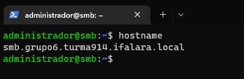

## Passo 1: Instalar o Servidor Samba
Você precisará instalar o pacote samba no servidor. Para fazer isso, vá para o terminal e digite:

```
sudo apt install samba
```

Verifique se o samba foi instalado corretamente com o seguinte comando: 

```
whereis samba
```

Exemplo: 
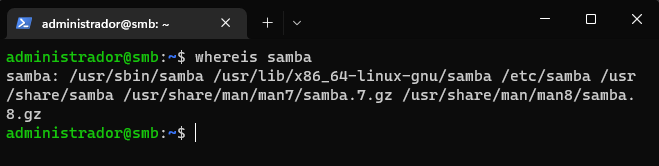

## Passo 2: Configurar o arquivo smb.conf
Antes de configurar, faça o backup do arquivo de configuração do samba. Utilize os comandos:

```
sudo cp /etc/samba/smb.conf{,.backup}
sudo bash -c 'grep -v -E "^#|^;" /etc/samba/smb.conf.backup | grep . > /etc/samba/smb.conf'
```

Exemplo: 
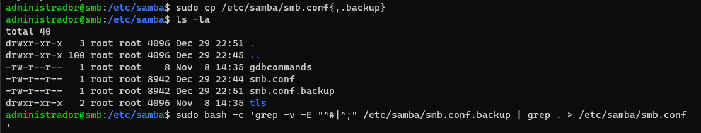

Agora que o servidor Samba está instalado, você precisará configurar o arquivo smb.conf. Este arquivo contém as configurações de compartilhamento de arquivos para o servidor.

Para isso, você pode usar o nano para editar o arquivo `smb.conf`.

```
sudo nano /etc/samba/smb.conf
```

Exemplo:
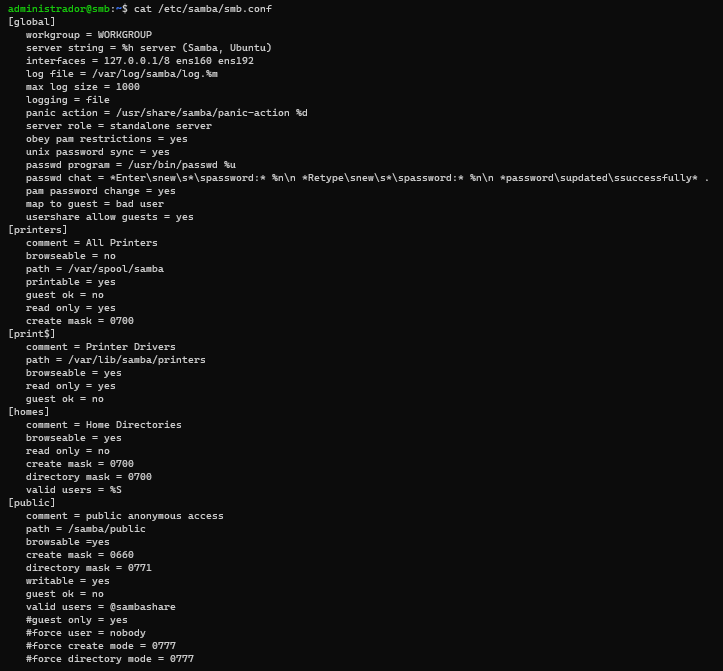

Reinicie o servidor samba com o comando:
```
sudo systemctl restart smbd
```

Exemplo
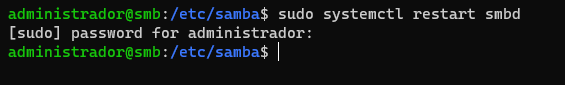

## Passo 3: Criar os Usuários de Compartilhamento

Primeiro, crie um usuário para o compartilhamento.

Exemplo: 
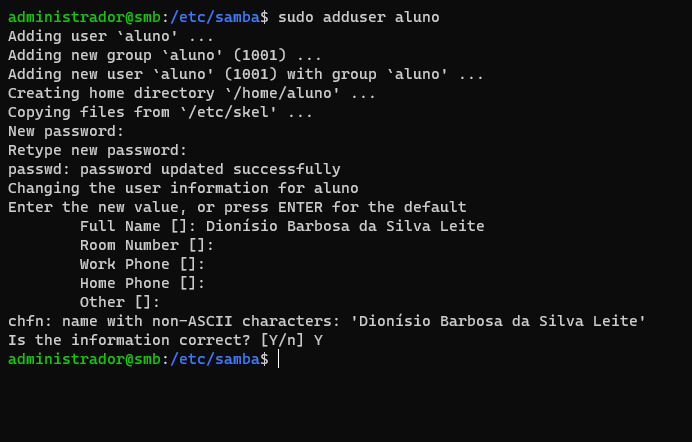

Você precisará criar os usuários que terão acesso aos arquivos compartilhados. Isso pode ser feito com o comando "smbpasswd".

Exemplo: 
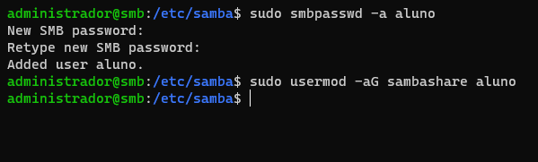

## Passo 4: Criar os Diretórios Compartilhados
Agora você precisará criar os diretórios que serão compartilhados. Para isso, use o comando "mkDIR".

Exemplo: 
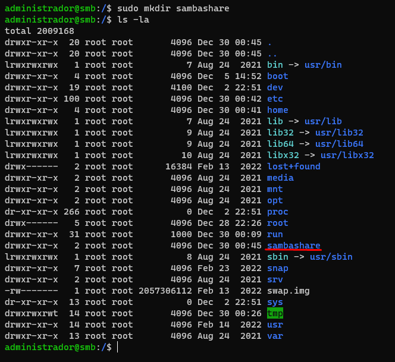

## Passo 5: Atribuir Permissões de Compartilhamento
Você precisará atribuir as permissões de compartilhamento aos usuários e diretórios criados anteriormente. Para fazer isso, use o comando "chmod".

Exemplo: 
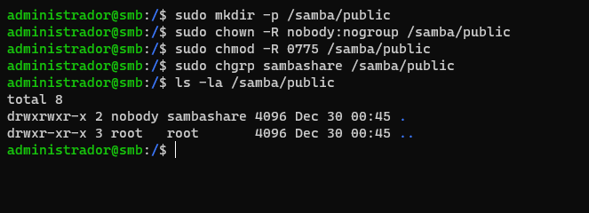

## Passo 6: Testar o Servidor Samba

Abra o explorador de arquivos e coloque o endereço como o ip do servidor samba. Em seguida, logue com o usuário e senha configurados anteriormente no servidor.

Login: 
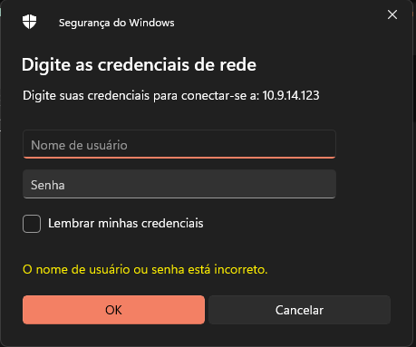

Acesso aos arquivos: 
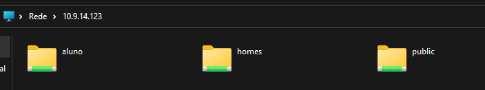

Se tudo foi configurado corretamente, você deve ser capaz de conectar-se ao servidor e compartilhar arquivos.

---

Esperamos que este tutorial tenha lhe ajudado a criar um servidor Samba. 
